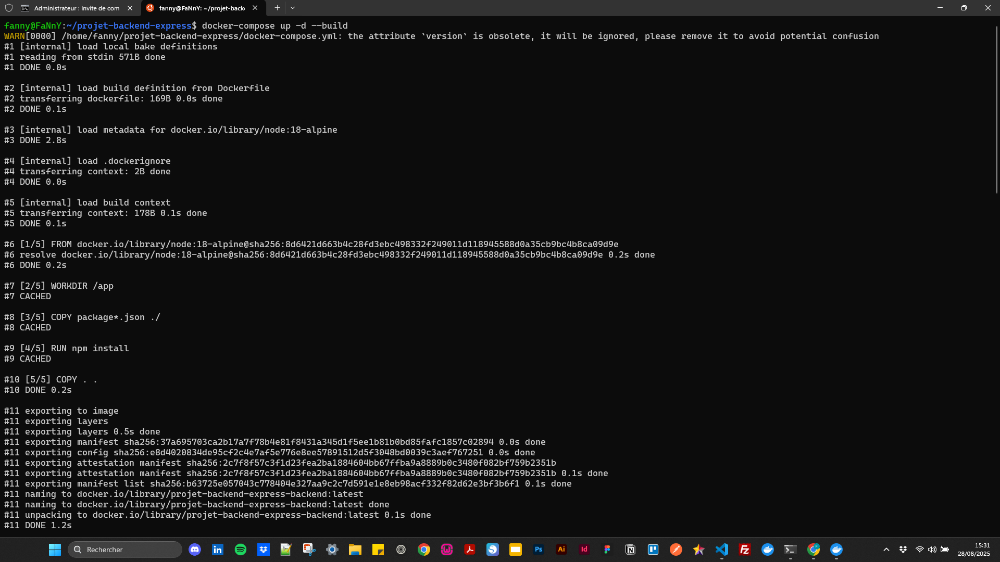
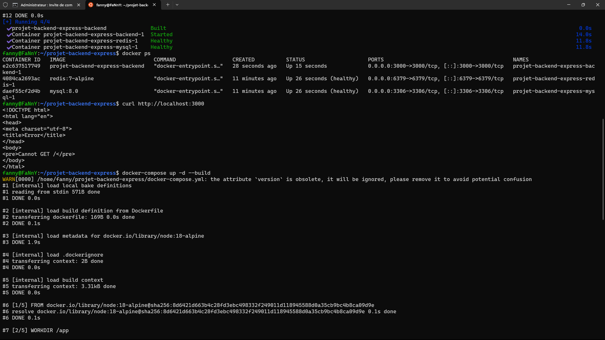
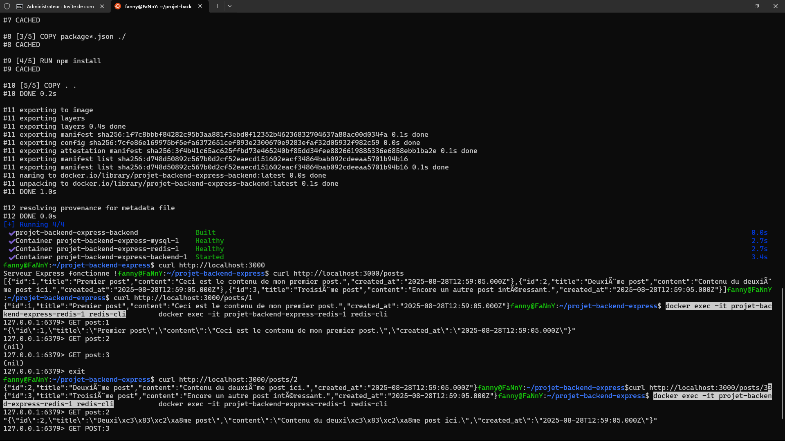
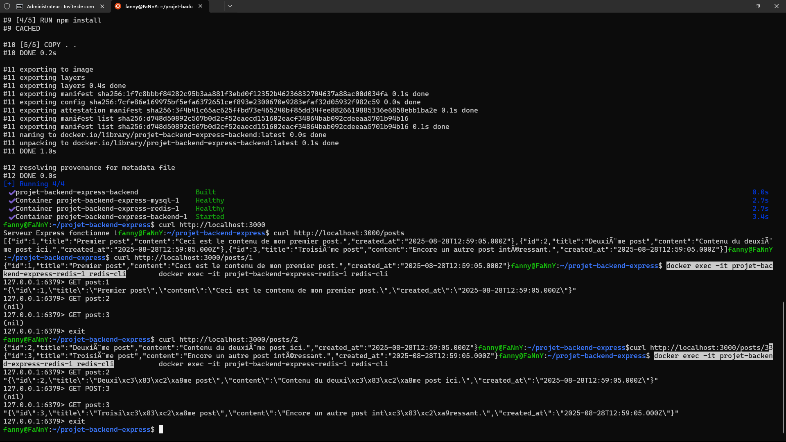
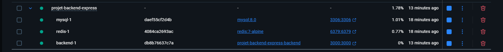

# Projet Backend Express – Challenge Docker, MySQL & Redis


## Description

Ce projet est un backend Node.js utilisant Express, connecté à une base de données MySQL et à Redis via Docker.  
Il expose des endpoints pour consulter des posts stockés en base, avec une optimisation de cache grâce à Redis.

> **Note Docker Compose** :
> Si vous voyez l’avertissement `the attribute version is obsolete`, vous pouvez ignorer ce message ou retirer la clé `version` du fichier `docker-compose.yml`.

## Fonctionnalités

- Serveur Express (Node.js)
- Base de données MySQL (port 3306 exposé)
- Base de données Redis (port 6379 exposé)
- Endpoint `/posts` : liste tous les posts
- Endpoint `/posts/:id` : affiche un post par son id, avec cache Redis

## Prérequis

- [Docker](https://www.docker.com/)
- [Docker Compose](https://docs.docker.com/compose/)
- (Optionnel) Node.js et npm pour développement local

## Installation & Lancement

1. **Cloner le projet**

   ```bash
   git clone <url-du-repo>
   cd projet-backend-express
   ```

2. **Lancer les services avec Docker Compose**

   ```bash
   docker-compose up -d --build
   ```

   Cela va :

   - Construire l’image du backend
   - Démarrer MySQL, Redis et le serveur Express

3. **Accéder à l’API**

- Le serveur Express écoute sur le port `3000`
- MySQL : port `3306`
- Redis : port `6379`

## Structure du projet

```bahs
projet-backend-express/
│
├── assets/
│   └── img/
│       ├── image-1.png
│       ├── image-2.png
│       ├── image-3.png
│       ├── image-4.png
│       └── docker-desktop.png
│
├── backend/
│   ├── db.js           # Connexion MySQL
│   ├── redis.js        # Connexion Redis
│   ├── server.js       # Serveur Express & endpoints
│   ├── package.json
│   └── Dockerfile
│
├── mysql/
│   └── init.sql        # Script d'initialisation de la BDD (données de test)
│
├── docker-compose.yml
└── README.md
```

## Endpoints

- `GET /posts`  
  Retourne la liste de tous les posts.

- `GET /posts/:id`  
  Retourne le post correspondant à l’id.  
  Optimisation :
  - Cherche d’abord dans Redis (cache)
  - Si absent, va chercher dans MySQL puis stocke le résultat dans Redis

## Tests manuels

Après le démarrage, vous pouvez tester le bon fonctionnement avec :

```bash
# Vérifier que le serveur répond
curl http://localhost:3000
# → Serveur Express fonctionne !

# Lister tous les posts
curl http://localhost:3000/posts
# → Affiche un tableau JSON de posts

# Récupérer un post précis (ex : id=1)
curl http://localhost:3000/posts/1
# → Affiche le post en JSON

# Vérifier le cache Redis (optionnel)
docker exec -it projet-backend-express-redis-1 redis-cli
GET post:1
# → Affiche le post en cache (format JSON)
exit
```

Si un post n’existe pas, la réponse sera :

```json
{ "error": "Post non trouvé" }
```

## Initialisation de la base de données

Le fichier `mysql/init.sql` permet d’insérer des données de test dans la base MySQL au démarrage du conteneur.

## Explications techniques & fonctionnement observé

- **Connexion MySQL** : via le module `mysql2` dans `db.js`
- **Connexion Redis** : via le module `redis` dans `redis.js`
- **Cache Redis** :  
  Lorsqu’un post est demandé via `/post/:id`, le serveur :
  1.  Cherche la donnée dans Redis
  2.  Si trouvée, la retourne immédiatement
  3.  Sinon, interroge MySQL, retourne la donnée et la met en cache dans Redis pour les prochaines requêtes

## Arrêter les services

```bash
docker-compose down
```

## Captures d’écran

Voici quelques captures illustrant le fonctionnement du projet :

### Utilisation du terminal Ubuntu

| Commandes Docker & API                |                                       |
| ------------------------------------- | ------------------------------------- |
|  |  |
|  |  |

### Visualisation sur Docker Desktop



Ce projet est un challenge pour apprendre à :

- Mettre en place un backend Express avec Docker
- Gérer une base MySQL et Redis en conteneurs
- Optimiser les accès aux données avec un système de cache

---

N’hésite pas à adapter ce README selon tes besoins ou à ajouter d’autres exemples de requêtes ou de tests !

---

# Workflow Complet : Backend Express + MySQL + Redis

Ce guide permet de tester et vérifier le fonctionnement complet de ton backend Express connecté à MySQL et Redis, depuis le terminal.

## 1️⃣ Vérifier que les conteneurs tournent

```bash
docker ps
```

Tu devrais voir :

- `projet-backend-express-backend-1`
- `projet-backend-express-mysql-1`
- `projet-backend-express-redis-1`

## 2️⃣ Tester la racine et récupérer tous les posts

```bash
curl http://localhost:3000
curl http://localhost:3000/posts
```

## 3️⃣ Vérifier le cache Redis avant d’accéder aux posts

```bash
docker exec -it projet-backend-express-redis-1 redis-cli
GET post:1
GET post:2
GET post:3
EXIT
```

## 4️⃣ Récupérer un post spécifique pour peupler le cache

```bash
curl http://localhost:3000/posts/1
curl http://localhost:3000/posts/2
curl http://localhost:3000/posts/3
```

## 5️⃣ Vérifier que Redis contient maintenant les posts

```bash
docker exec -it projet-backend-express-redis-1 redis-cli
GET post:1
GET post:2
GET post:3
```

- Première requête → MySQL + cache
- Seconde requête → Redis

## 6️⃣ Tester la suppression du cache (optionnel)

```bash
docker exec -it projet-backend-express-redis-1 redis-cli
DEL post:1
GET post:1
```

- `(nil)` → clé supprimée
- Refais `curl http://localhost:3000/posts/1` → MySQL + cache recréé

## 7️⃣ Conseils pour tester d’autres posts

```bash
KEYS *
DEL post:2
```

- Voir toutes les clés et supprimer pour tester le cache.

---
